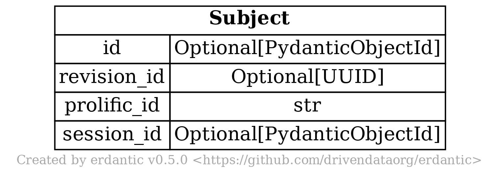
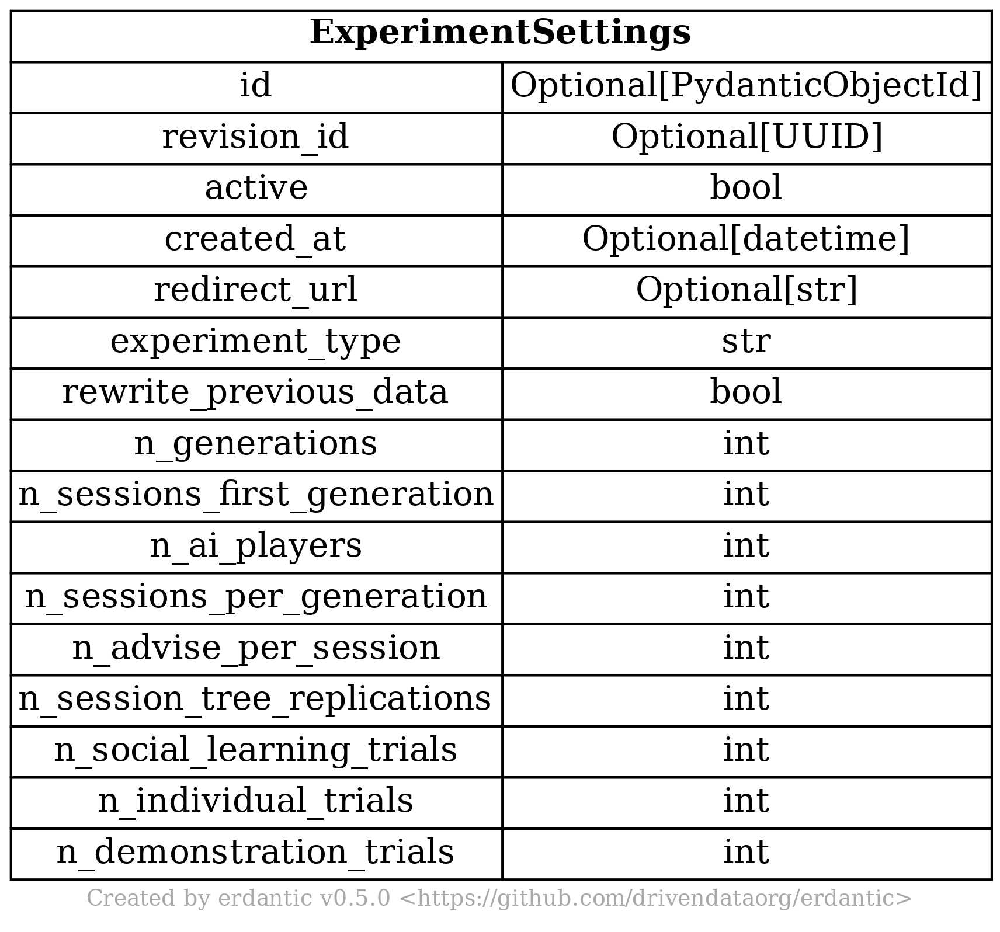
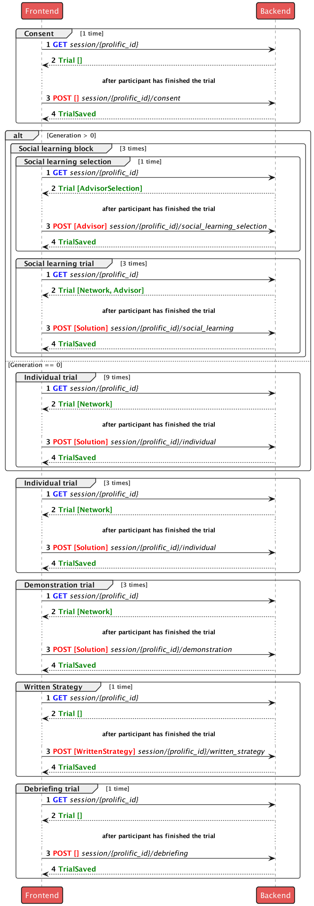

# Reward Network III

## Admin API

### Create a new study

`POST https://rn-iii-backend.eks-test-default.mpg-chm.com/admin/config`

#### Pilot 1A

```json

{
  "active": true,
  "redirect_url": "https://app.prolific.co/submissions/complete?cc=<code>",
  "experiment_type": "rn-iii-pilot-1a",
  "rewrite_previous_data": false,
  "n_generations": 1,
  "n_sessions_first_generation": 10,
  "n_ai_players": 0,
  "n_sessions_per_generation": 10,
  "n_advise_per_session": 5,
  "n_session_tree_replications": 1,
  "n_social_learning_trials": 2,
  "n_individual_trials": 6,
  "n_demonstration_trials": 2
}

```

#### Pilot 1B

```json

{
  "active": true,
  "redirect_url": "https://app.prolific.co/submissions/complete?cc=<code>",
  "experiment_type": "rn-iii-pilot-1a",
  "rewrite_previous_data": false,
  "n_generations": 2,
  "n_sessions_first_generation": 10,
  "n_ai_players": 10,
  "n_sessions_per_generation": 10,
  "n_advise_per_session": 5,
  "n_session_tree_replications": 1,
  "n_social_learning_trials": 2,
  "n_individual_trials": 6,
  "n_demonstration_trials": 2
}

```

### Get the current study configuration

`GET https://rn-iii-backend.eks-test-default.mpg-chm.com/admin/config`

### Get the current study session tree

`GET https://rn-iii-backend.eks-test-default.mpg-chm.com/progress/`

### Get all results in the database

`GET https://rn-iii-backend.eks-test-default.mpg-chm.com/results/sessions`

### Get results for a specific experiment

`GET https://rn-iii-backend.eks-test-default.mpg-chm.com/results/sessions?experiment_type=rn-iii-pilot-1a&finished=true`

## DB models

### Session

<p align="centre">

</p>

### Subject

<p align="centre">

</p>

### Experiment Settings

<p align="centre">

</p>

## Development environment

Development environment is defined in `docker-compose-dev.yml` file. To simplify
docker-compose usage, one can set `docker-compose-dev.yml` as an environmental
variable in `.env` file: `COMPOSE_FILE=docker-compose-dev.yml`.

Set up the development environment (it can take several minutes first time):

```bash

docker-compose -f docker-compose-dev.yml up

```

NOTE: you can use `--build` flag to rebuild images and `-d` to run in detached
mode.

To run only the backend containers one can use the following command:

```bash

docker-compose -f docker-compose-dev.yml up -d database fastapi

```

Stop everything and remove all volumes:

```bash

docker-compose -f docker-compose-dev.yml down --volumes

```

### Run pytest

Create the virtual environment in the backend folder:

```zsh

# cd backend

python3 -m venv venv
 
source venv/bin/activate

python3 -m pip install --upgrade pip

pip --no-cache-dir install -e .

pip install -r requirements_pytest.txt

```

Run pytest:

```zsh

cd backend/app

# set the environment variables
export BACKEND_USER=admin
export BACKEND_PASSWORD=admin

# run pytest
python -m pytest -vv -s

```

See [pytest docs](https://docs.pytest.org/en/7.1.x/how-to/usage.html#invoke-python)
for more details.

### `apiTypes.ts`

`apiTypes.ts` file is generated in the `server.py` each time FastAPI server is
restarted and then copied in frontend `src` folder.

Useful commands to clean up the system:

```bash

docker system df # check disk usage
docker system prune --all --force # clean up unused images and volumes
docker system prune --volumes --force # clean up unused volumes

```

### Links for development

- React: http://localhost:9000/
- Storybook: http://localhost:6006/
- Swagger UI FastAPI: http://localhost:5000/docs

## Deployment

GitLab repo is available
at [https://gitlab.gwdg.de/mpib/chm/hci/reward-networks/reward-network-iii](https://gitlab.gwdg.de/mpib/chm/hci/reward-networks/reward-network-iii)

- Frontend
  URL:  [https://rn-iii-frontend.eks-test-default.mpg-chm.com](https://rn-iii-frontend.eks-test-default.mpg-chm.com)
- Backend
  URL: [https://rn-iii-backend.eks-test-default.mpg-chm.com](https://rn-iii-backend.eks-test-default.mpg-chm.com)

### Logs in New Relic

- Frontend pod
  logs: [https://onenr.io/0vwBm6lgoQp](https://onenr.io/0vwBm6lgoQp)
- Backend pod logs: [https://onenr.io/0gR7DGq3xjo](https://onenr.io/0gR7DGq3xjo)

### Deployment notes

- Frontend and backend pipelines are triggered by the parent
  pipeline [`.gitlab-ci.yml`](.gitlab-ci.yml).
- In order to run two separate pipelines from the same repo, we need to copy the
  content of [`frontend`](frontend) and [`backend`](backend) folders to the root
  of the repo before running the corresponding child
  pipeline ([`.gitlab-ci-frontend.yml`](`.gitlab-ci-frontend.yml`)
  or [`.gitlab-ci-backend.yml`](.gitlab-ci-backend.yml)).
- [`frontend`](frontend) folder should be deleted before the `build` stage of
  the [`.gitlab-ci-frontend.yml`](.gitlab-ci-frontend.yml) pipeline. This is
  necessary to avoid typescript errors when building the frontend.

## Backend-Frontend interaction scheme

<p align="centre">

</p>

